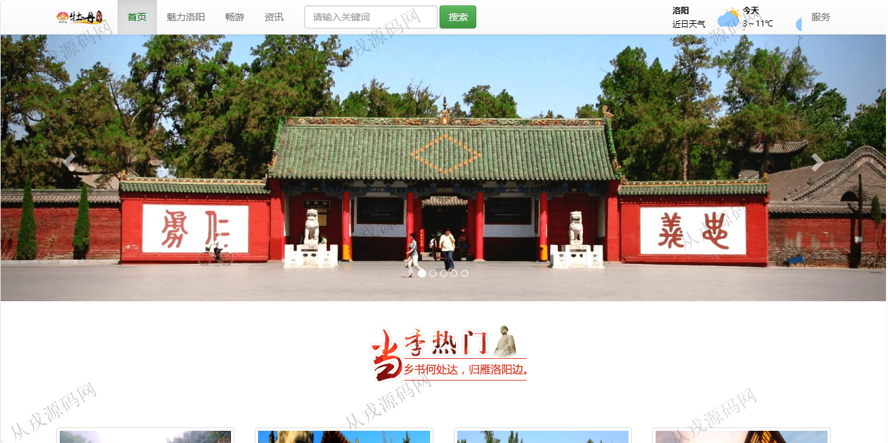
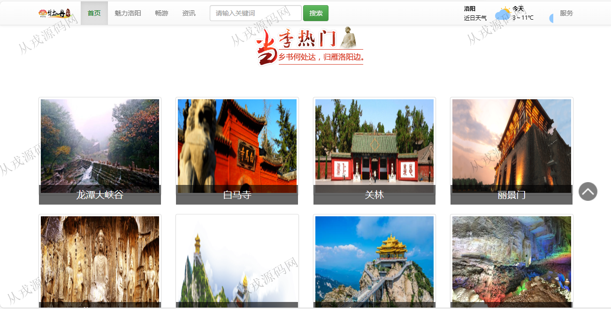
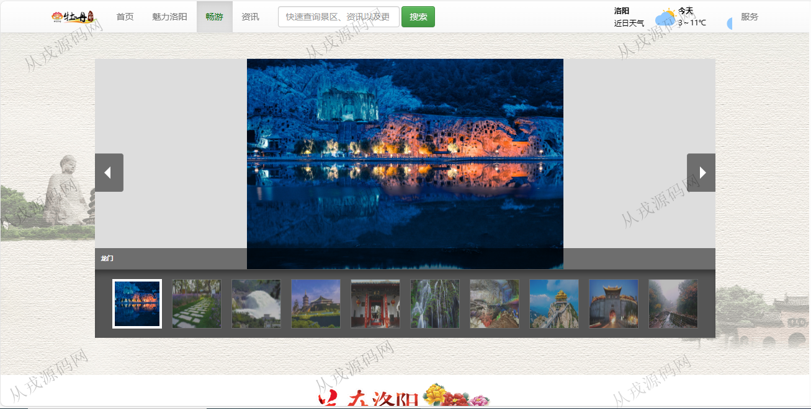
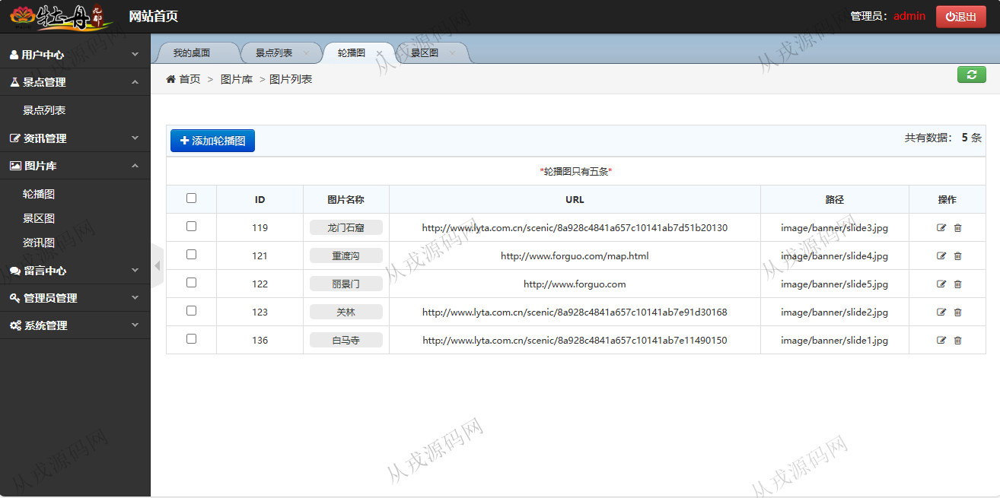
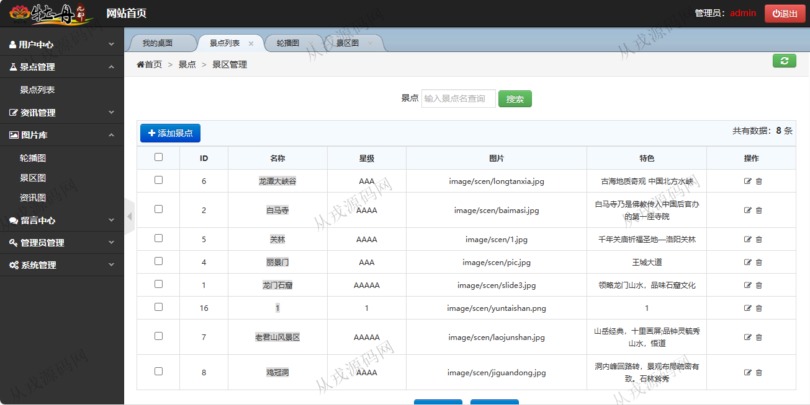
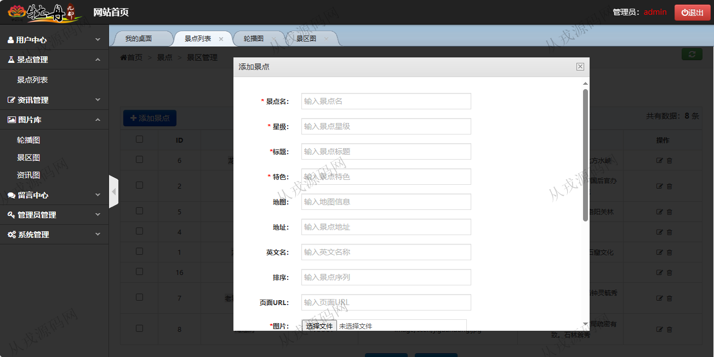
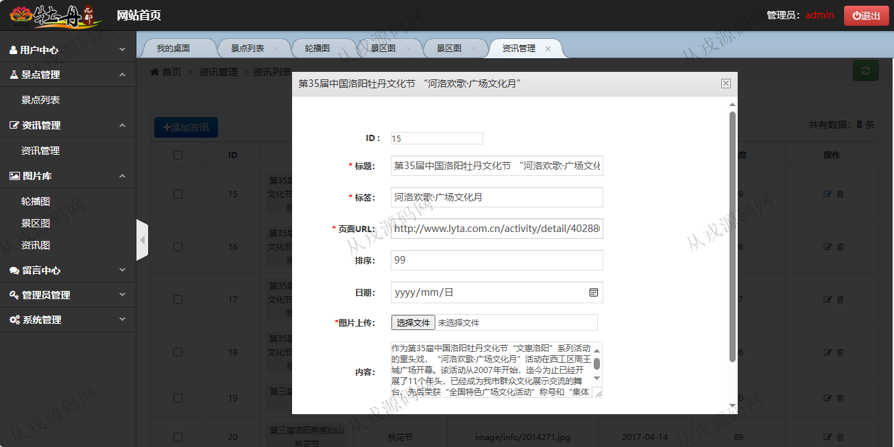
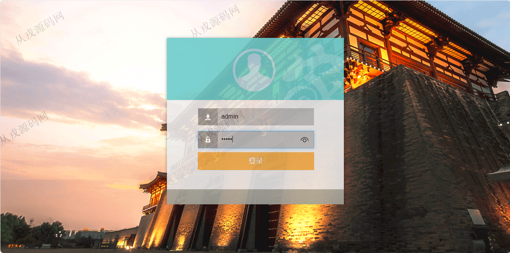

<h1 align="center">145.洛阳旅游管理系统</h1>

- <b>完整代码获取地址：从戎源码网 ([https://armycodes.com/](https://armycodes.com/))</b>
- <b>技术探讨、资料分享，请加QQ群：692619798</b> 
- <b>作者微信：19941326836  QQ：952045282</b> 
- <b>承接计算机毕业设计、Java毕业设计、Python毕业设计、深度学习、机器学习</b>
- <b>选题+开题报告+任务书+程序定制+安装调试+论文+答辩ppt 一条龙服务</b>
- <b>所有选题地址 ([https://github.com/YuLin-Coder/AllProjectCatalog](https://github.com/YuLin-Coder/AllProjectCatalog)) </b>

## 项目介绍
基于java+jsp的洛阳旅游管理系统：前端 jsp、jquery，后端 servlet、jdbc；集成景点、资讯、留言等功能于一体的系统。

## 功能介绍

- 网站首页：主导航栏，关键词搜索，天气情况展示，轮播图，当季热门旅游景点，热门资讯
- 畅游：景点介绍，景点详情展示
- 资讯：前台资讯内容展示
- 景点管理：景点信息的增删改查，景点图片上传，景点名称模糊搜索
- 资讯管理：资讯信息的增删改查，资讯图片上传
- 留言中心：留言列表查询，留言删除
- 管理员管理：管理员账号的增删改查
- 系统管理：基本设置，网站的名称、关键词、描述、底部等信息的设置

## 环境

- <b>IntelliJ IDEA 2021.3</b>

- <b>Mysql 5.7.26</b>

- <b>Tomcat 7.0.73</b>

- <b>JDK 1.8</b>

## 运行截图

